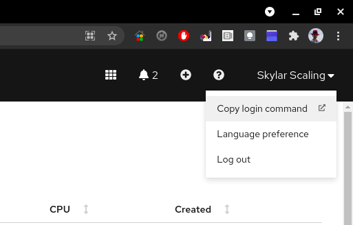

# Introduction
This repository contains re-usable scripts and templates to deploy OpenShift, RHACM, and related infrastructure.

# Getting Started

## Installation Process
To work with this repository locally you will need clone it using https or ssh authentication.

For https:
```
git clone https://github.com/SkylarScaling/rhacm-ocp-automation-infra-lib.git
```

For ssh:
```
git clone git@github.com:SkylarScaling/rhacm-ocp-automation-infra-lib.git
```

## Assertions and Assumptions

This automation assumes the following conditions have been met.

- The AWS credentials are kept in the ~/.aws directory of the user running the ansible playbook
- The following software dependencies have been installed (Can be installed using the Ansible playbook listed below.)
- There are enough resources in the subscription to deploy the cluster
  - For information on subscription defaults,and how to check the quotas set for the subscription: **#TODO**
  - For a new cluster, make sure you have room for the following: 
  https://docs.openshift.com/container-platform/4.7/installing/installing_aws/installing-aws-account.html#installation-aws-limits_installing-aws-account

# How to Install Prerequisites
### Software dependencies (for cluster deployment)

There are a handful of tools that you'll need to be able to effectively work with this repository. Please make sure you have the following things installed. 
Any commands provided are for linux systems.

- [Python 3+](https://www.python.org/downloads/) Installed
- [git](https://git-scm.com/book/en/v2/Getting-Started-Installing-Git) Installed
- [Ansible](https://docs.ansible.com/ansible/latest/installation_guide/intro_installation.html) Installed

> NOTE: Ansible will need python 3 in order to use the required modules and libraries, so it is recommended that you use 
> the following command to install Ansible: 
>
> ```
> $ pip3 install ansible
> ```
> You can then confirm which python version is being used by running:
> ```
> $ ansible --version | grep "python version"
> ```
> Example output:
> ```
> python version = 3.6.8 (default, Mar 18 2021, 08:58:41) [GCC 8.4.1 20200928 (Red Hat 8.4.1-1)]
> ```

The utilites in the list below are also required, but can be installed automatically by executing the Ansible playbook listed below, once Ansible is installed.

- [OpenShift CLI](https://docs.openshift.com/container-platform/4.7/cli_reference/openshift_cli/getting-started-cli.html) Installed
- [AWS CLI](https://docs.aws.amazon.com/cli/latest/userguide/install-cliv2.html) Installed
- [OpenShift Installer CLI](https://cloud.redhat.com/openshift/install/aws/installer-provisioned) Installed
- [Python Modules](https://docs.python.org/3/installing/index.html):
  - [kubernetes](https://pypi.org/project/kubernetes/)
  - [openshift](https://pypi.org/project/openshift/)
  - [boto3](https://pypi.org/project/boto3/)
  
They can be automatically installed by running the following command: 

```
$ ansible-playbook playbooks/setup-prereqs.yaml --ask-become-pass
```

> **Notes:**
>
> *Arguments*
>
> `--ask-become-pass` This will prompt for your root password, so required python libraries can be installed.

You can force the OpenShift binaries to update (if you already have oc and openshift-install on your system), by using the following command:
```
$ ansible-playbook playbooks/setup-prereqs.yaml --ask-become-pass -e force_update=true
```

> **Notes:**
>
> *Arguments*
>
> `force_update` This will tell Ansible to delete the existing oc and openshift-install binaries, forcing new versions to be installed.

### Ansible Vault Password File
Ansible Vault is used to encrypt sensitive data in the repository, and in order to simplify automation for users, a
password file needs to be created. 

This can be done by running the following playbook:
```
$ ansible-playbook playbooks/create-passfile.yaml
```

You will be prompted to input the Ansible Vault password. You can get this password from a team member that already knows it.

> **DO NOT COMMIT THIS PASSWORD TO ANY REPOSITORY, EVER.**

# How to Deploy the OCP RHACM Hub Cluster
The OpenShift Container Platform / Red Hat Advanced Cluster Management hub cluster can be created using the following command: 

---

> **IMPORTANT**: Be sure to capture the install configs as described below, so you can use them to easily destroy the 
> hub cluster when needed.

---

```
$ ansible-playbook playbooks/deploy-hub.yaml \
  -i ../ocp-infra-deploy/hub/inventory \
  -e hub_cluster_name=<hub-cluster-name> \
  -e cloud_provider=aws \
  -e aws_region=<aws-region> \
  --vault-password-file=~/.passfile
```
> **Notes:**
>
> *Dependencies*
>
> The `ocp-infra-deploy` repository must be checked out in the same directory as `ocp-infra-lib` in order to access the required inventory file
> 
> *Variables*
>
> `hub_cluster_name` The desired name for the hub cluster.
>
> `cloud_provider` The platform this hub cluster will be deployed to. (Supported values: aws)
>
> `aws_region` The AWS region the cluster will be deployed to. (Update as desired)
>
> *Ansible Vault*
>
> `--vault-password-file` This argument will direct Ansible Vault to a password file in order to access encrypted values 
> for the install. This file should always be `~/.passfile`. Follow the [instructions above](#ansible-vault-password-file) to create the passfile.

#### Capture Install Configs for Cluster Destruction

After the hub installation is complete, we want to save the install config to a secure location so we can access it later,
when we are ready to cleanly destroy the hub cluster and remove all resources from AWS.

When the hub install is complete, copy the directory and all of its contents from `/tmp/install/<hub-cluster-name>` to a secure
location, like an S3 bucket in AWS.

#### Commit kubeadmin-password to `ocp-gitops-infra-config` Repo

> NOTE: If a cluster exists that doesn't have a kubeadmin-password file committed to ocp-gitops-infra-config, you can 
> generate one by following the steps [below](#manually-generating-a-kubeadmin-password-file).

After the hub installation is complete, we also want to commit the generated kubeadmin-password file for the cluster to 
the `ocp-gitops-infra-config` repository. 

The password is encrypted with Ansible Vault, so it can be securely store in 
the repo.

```
$ cd ../ocp-gitops-infra-config
$ git add clusters/<hub-cluster-name>
$ git commit -m "Added new cluster credentials"
$ git push origin     
```

# How to Deploy the Pre-Production Cluster
The Pre-Prod OCP managed cluster should be deployed using automation by following the steps below:

---

> **IMPORTANT**: You will need to commit the generated `kubeadmin-password` file to the `ocp-gitops-infra-config` 
> repo, as described at the end of this section.

---

```
$ ansible-playbook playbooks/deploy-managed-cluster.yaml \
  -i ../ocp-infra-deploy/evt/inventory \
  -e hub_cluster_name=<hub-cluster-name> \
  -e cluster_name=<cluster-name> \
  -e cloud_provider=aws \
  -e aws_region=<aws-region> \
  --vault-password-file=~/.passfile
```

> **Notes:**
>
> *Dependencies*
>
> The `ocp-infra-deploy` repository must be checked out in the same directory as `ocp-infra-lib` in order to access the required inventory file
>
> *Variables*
>
> `hub_cluster_name` The name of the hub cluster that will manage this cluster.
>
> `cluster_name` The desired name for the cluster.
>
> `cloud_provider` The platform this hub cluster will be deployed to. (Supported values: aws)
>
> `aws_region` The AWS region the cluster will be deployed to. (Update as desired)
>
> *Ansible Vault*
>
> `--vault-password-file` This argument will direct Ansible Vault to a password file in order to access encrypted values 
> for the install. This file should always be `~/.passfile`. Follow the [instructions above](#ansible-vault-password-file) to create the passfile.

#### Commit kubeadmin-password to `ocp-gitops-infra-config` Repo

> NOTE: If a cluster exists that doesn't have a kubeadmin-password file committed to ocp-gitops-infra-config, you can 
> generate one by following the steps [below](#manually-generating-a-kubeadmin-password-file).

After the cluster installation is complete, we also want to commit the generated kubeadmin-password file for the cluster to 
the `ocp-gitops-infra-config` repository. 

The password is encrypted with Ansible Vault, so it can be securely stored in 
the repo.

```
$ cd ../ocp-gitops-infra-config
$ git add clusters/<cluster-name>
$ git commit -m "Added new cluster credentials"
$ git push origin     
```

# How to Deploy a Development Cluster
A development OCP cluster can be deployed one of two ways:

1. Using the RHACM console UI ([Click HERE](rhacm-install.md) for detailed steps) 
2. Using an Ansible playbook (Detailed steps below)

A development cluster with the default configuration can be easily created by running the following command:

---

> **IMPORTANT**: You will need to commit the generated `kubeadmin-password` file to the `ocp-gitops-infra-config` 
> repo, as described at the end of this section.

---

```
$ ansible-playbook playbooks/deploy-managed-cluster.yaml \
  -i ../ocp-infra-deploy/dev/inventory \
  -e hub_cluster_name=<hub-cluster-name> \
  -e cluster_name=<cluster-name> \
  -e cloud_provider=aws \
  -e aws_region=<aws-region> \
  --vault-password-file=~/.passfile
```
> **Notes:**
>
> *Dependencies*
>
> The `ocp-infra-deploy` repository must be checked out in the same directory as `ocp-infra-lib` in order to access the required inventory file
> 
> You will also need to be authenticated with the RHACM hub cluster in order to successfully populate the kubeconfig for registering the cluster with RHACM.
> 
> This can be accomplished by logging into the URL below and choosing `Copy login command` from the user menu 
> (replacing `ocp-hub` with the appropriate hub cluster name, if it has been changed from the default):
>
> https://console-openshift-console.apps.ocp-hub.\<domain\>/
>
> 
>
> *Variables*
>
> `hub_cluster_name` The name of the hub cluster that will manage this cluster.
>
> `cluster_name` The desired name for the cluster.
>
> `cloud_provider` The platform this hub cluster will be deployed to. (Supported values: aws)
>
> `aws_region` The AWS region the cluster will be deployed to. (Update as desired)
>
> *Ansible Vault*
>
> `--vault-password-file` This argument will direct Ansible Vault to a password file in order to access encrypted values 
> for the install. This file should always be `~/.passfile`. Follow the [instructions above](#ansible-vault-password-file) to create the passfile.

#### Commit kubeadmin-password to `ocp-gitops-infra-config` Repo

> NOTE: If a cluster exists that doesn't have a kubeadmin-password file committed to ocp-gitops-infra-config, you can 
> generate one by following the steps [below](#manually-generating-a-kubeadmin-password-file).

After the cluster installation is complete, we also want to commit the generated kubeadmin-password file for the cluster to 
the `ocp-gitops-infra-config` repository. 

The password is encrypted with Ansible Vault, so it can be securely stored in the repo.

```
$ cd ../ocp-gitops-infra-config
$ git add clusters/<cluster-name>
$ git commit -m "Added new cluster credentials"
$ git push origin     
```

# How to Deploy an EFA Worker Node to an Existing Cluster

After creating a new cluster, an EFA worker node can be deployed to an OCP cluster on AWS by using the following playbooks:

> NOTE: At the time of writing, support for the NetworkInterfaceAdapterType specification has not been added. This
> process will need to be tested once this feature is added in OCP 4.10.

```
$ ansible-playbook playbooks/create-efa-node.yaml \
  -i ../ocp-infra-deploy/dev/inventory \
  -e cluster_name=efa-upi \
  -e aws_region=us-east-1 \
  -e aws_az=us-east-1c \
  --vault-password-file=~/.passfile
```
> **Notes:**
>
> *Dependencies*
>
> The `ocp-infra-deploy` repository must be checked out in the same directory as `ocp-infra-lib` in order to access the required inventory file
> 
> *Variables*
>
> `cluster_name` The name of the destination cluster. (This must match the cluster subdomain. i.e. `ocp-hub` for `ocp-hub.<domain>`)
>
> `aws_region` The AWS region the cluster will be deployed to. (Update as desired)
>
> `aws_az` The AWS availability zone the node will be deployed to. (Update as desired)
>
> *Ansible Vault*
>
> `--vault-password-file` This argument will direct Ansible Vault to a password file in order to access encrypted values 
> for the install. This file should always be `~/.passfile`. Follow the [instructions above](#ansible-vault-password-file) to create the passfile.

## Adding the EFA Security Group to the EFA Network Interface
> NOTE: Since the EFA Node deployment is untested, it's not clear if an EFA Security Group will be automatically added to the
> EFA Node, so this step may need to be performed manually.

In order to add a Security Group to a Network Interface in AWS, use the following playbook:

```
$ ansible-playbook playbooks/aws-add-security-group.yaml \
  -i ../ocp-infra-deploy/dev/inventory \ 
  -e aws_region=us-east-1 \
  -e network_interface_id=<efa-network-interface-id> \
  -e efa_security_group_id=<efa-security-group-id>
```
> **Notes:**
>
> *Dependencies*
>
> The `ocp-infra-deploy` repository must be checked out in the same directory as `ocp-infra-lib` in order to access the required inventory file
> 
> *Variables*
>
> `aws_region` The AWS region where the network interface exists.
>
> `network_interface_id` The network interface id to assign the security group to. This can be found in AWS by looking
> at the assigned network interface for the EC2 instance corresponding to the node you created.
>
> `efa_security_group_id` The ID for the security group that was created alongside the EFA node by the playbook above.
> This can be found by looking at the security groups assigned to the VPC for the designated cluster, and finding the one
> that has been named `EFA group for <vpc_id>`. 

# Manually Generating a kubeadmin-password File

Since the infrastructure automation relies on encrypted `kubeadmin-password` files, it may be helpful to generate one manually
in case one gets lost or isn't properly committed to the `ocp-gitops-infra-config` repository.

> NOTE: Be sure you have an existing `~/.passfile` with the desired Ansible Vault password defined. If you don't have one, 
> follow the steps [above](#ansible-vault-password-file).

Run the following playbook:
```
$ ansible-playbook playbooks/generate-kubeadmin-password-file.yaml \
  -e cluster_name=<cluster-name>  
```

You will be prompted to enter the `kubeadmin` password twice for confirmation.

> *Variables*
>
> `cluster_name` The name of the cluster

# How to Install Certificates to a Cluster
Let's Encrypt certificates can be installed to a cluster by running the following playbook:

```
$ ansible-playbook playbooks/install-certificates.yaml \
  -i ../ocp-infra-deploy/<environment>/inventory \
  -e cluster_name=<cluster-name> \
  -e cloud_provider=aws \
  -e aws_region=<aws-region> \
  --vault-password-file=~/.passfile
```
> **Notes:**
>
> *Dependencies*
>
> The `ocp-infra-deploy` repository must be checked out in the same directory as `ocp-infra-lib` in order to access the required inventory file
> 
> *Variables*
>
> `environment` The environment that contains the inventory file you are using for this cluster. (Supported values: dev, preprod, hub)
>
> `cluster_name` The name of the destination cluster. (This must match the cluster subdomain. i.e. `ocp-hub` for `ocp-hub.<domain>`)
>
> `cloud_provider` The platform this hub cluster will be deployed to. (Supported values: aws)
>
> `aws_region` The AWS region the cluster will be deployed to. (Update as desired)
>
> *Ansible Vault*
>
> `--vault-password-file` This argument will direct Ansible Vault to a password file in order to access encrypted values 
> for the install. This file should always be `~/.passfile`. Follow the [instructions above](#ansible-vault-password-file) to create the passfile.

# How to Configure SSO for a Cluster
This will apply oauth CRDs to the destination cluster and allow you to configure the cluster for SSO authentication using Azure AD.

```
$ ansible-playbook playbooks/setup-sso.yaml \
  -i ../ocp-infra-deploy/dev/inventory \
  -e aws_region=<aws-region> \
  --vault-password-file=~/.passfile
```

> **Notes:**
>
> *Dependencies*
>
> The `ocp-infra-deploy` repository must be checked out in the same directory as `ocp-infra-lib` in order to access the required inventory file
> 
> *Variables*
>
> `aws_region` The AWS region the cluster will be deployed to. (Update as desired)
>
> `kubeconfig` The location of the kubeconfig for your destination cluster. (If you follow the steps above for logging into
> the hub cluster, you can use the default location of `~/.kube/config`)
>
> *Ansible Vault*
>
> `--vault-password-file` This argument will direct Ansible Vault to a password file in order to access encrypted values 
> for the install. This file should always be `~/.passfile`. Follow the [instructions above](#ansible-vault-password-file) to create the passfile.

**Adding a Redirect URI**
> NOTE: *Until Microsoft Graph API permissions are added to allow the azure_sso_setup role to create Redirect URIs, 
> this step must be done manually.*

You will need to manually add a redirect URI in the Azure portal in order for SSO to access AD and work properly.

For the appropriate app in the Azure portal, go to Authentication.  

Under Web -> Redirect URIs, add a new URI with the following format:

```
https://oauth-openshift.apps.<cluster_name>.<domain>/oauth2callback/OCP_AAD
```
> *Variables:*
>
> Replace `<cluster_name>` with the name of your destination cluster.

**Be sure to click `Save` at the top of the page to save the entry.**

At this point, SSO is installed on your destination cluster, but you will need to add users/groups and role bindings to 
the cluster in order to apply the desired permissions to SSO users.

An example can be found in the `ocp-gitops-infra-config` repository under *clusters/hub/cluster-rbac*. 

# How to Destroy a Managed Cluster
A managed OCP cluster can be destroyed in the RHACM console by following the guide linked below:

Using the RHACM console UI ([Click HERE](rhacm-destroy.md) for detailed steps) 

# How to Destroy a Hub Cluster
Since hub clusters aren't managed by RHACM, you will need to use the original install config that you saved when the hub
was created in order to easily destroy the cluster and all related resources in AWS.

To destroy the hub cluster, copy the contents of the install config directory you saved locally, and execute the following command:

```
$ openshift-install destroy cluster --dir=<path-to-install-dir> --log-level=info
```

# Post-Install Cluster Configuration
The cluster can be configured once installed using the OpenShift GitOps application manager.  There are playbooks to define 
cluster configurations and to create the management application in the OpenShift GitOps ArgoCD service. Perform the post 
install steps for configuring the cluster infrastructure and creating the GitOps application. ([Click HERE](config-gitops.md) for detailed steps).

# Repository Structure
This repository follows a simple Ansible repository structure. At the top level there are playbooks and roles. 
Playbooks are scripts used to repeatably configure and deploy infrastructure. Roles are smaller modules of automation that can be called by playbooks. 
For more information on each directory, please take a look at the README in the respective directories.

# Contribute
To contribute, please follow these steps:

1. Clone repository locally.
2. Create branch for your code or configuration change.
3. Test your changes against the sandbox cluster (Please communicate with team if it will be disruptive).
4. Create a Pull Request to merge into master. Please make sure the PR is associated with your User Story or Task. This makes tracking far easier.
5. The Pull Request will be reviewed by 1 other engineer or architect, who will either approve it or leave feedback for enhancements.
6. The Pull Request will be merged once a peer has approved it.

