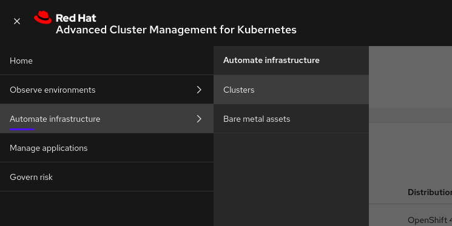
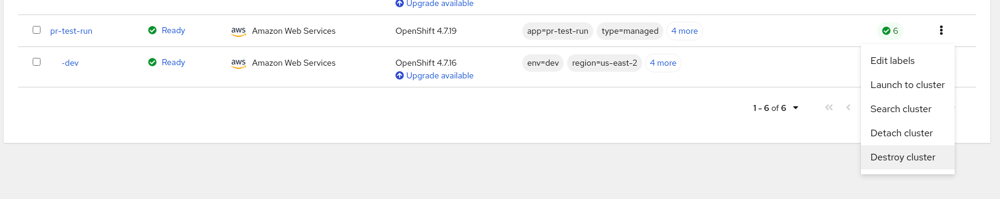
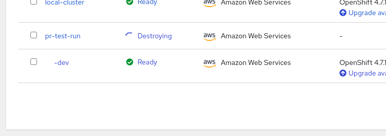

# How to Destroy an OCP Dev Cluster using RHACM
This document will walk you through the process of destroying an OpenShift cluster using RHACM.

## RHACM Console
The console for RHACM can be accessed from the link below.

> NOTE: If the name of the hub cluster has been changed from `ocp-hub`, substitute that name in the URL

https://multicloud-console.apps.ocp-hub.\<domain\>/multicloud/clusters

> NOTE:
> Developers who need access to RHACM should be added to the `ocp-cluster-admin-group.yaml` in the `ocp-gitops-infra-config` repo.
> That group also needs to applied to the hub cluster.

## How to Destroy a Cluster
(1) Once logged into the RHACM Console, navigate to Automate Infrastructure -> Clusters:

(2) In the cluster list, click the vertical `...` menu and select `Destroy cluster`:

(3) In the Destroy cluster dialog, enter the cluster name to confirm destruction, then click `Destroy`:

(4) The cluster status will change to `Destroying`, and will disappear from the list when complete:

