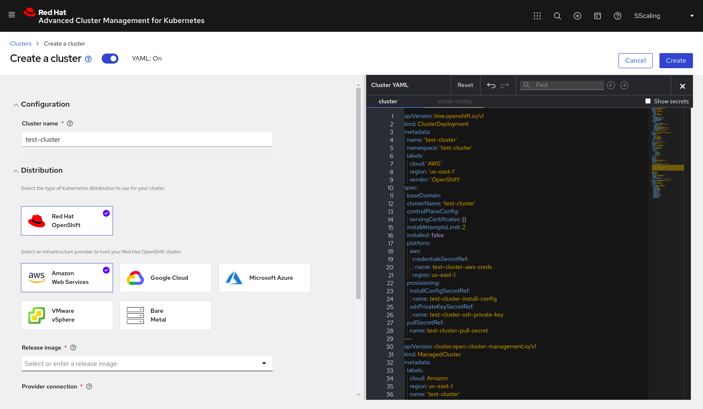
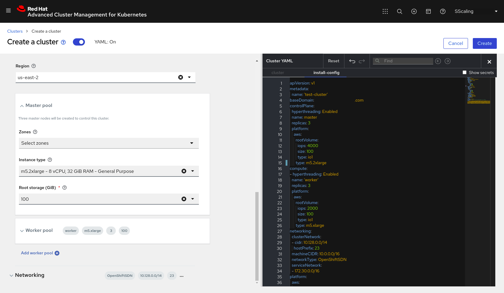

# How to Install an OCP Dev Cluster using RHACM
This document will walk you through the process of creating an OpenShift cluster on AWS for developer use, via the RHACM wizard.

## RHACM Console
The console for RHACM can be accessed from the link below.

> NOTE: If the name of the hub cluster has been changed from `ocp-hub`, substitute that name in the URL

https://multicloud-console.apps.ocp-hub.\<domain\>/multicloud/clusters

> NOTE:
> Developers who need access to RHACM should be added to the `ocp-cluster-admin-group.yaml` in the `ocp-gitops-infra-config` repo.
> That group also needs to applied to the hub cluster.

## How to Create a Cluster
(1) Once logged into the RHACM Console, navigate to Automate Infrastructure -> Clusters:

(2) In the top-right corner, select Add a cluster -> Create a cluster:

(3) In the Create a cluster wizard, enter a unique Cluster name:

(4) Select the desired Release image for your OCP Cluster, and the Provider connection you have configured for your destination cloud provider:

(5) Under Node pools, set the desired Region for the cluster, as well as the desired configuration for the Master pool:
> NOTE: m5.2xlarge is the recommended Instance type for OCP on AWS

(6) Under Worker pool, set the desired configuration for the Worker pool:
> NOTE: m5.2xlarge is the recommended Instance type for OCP on AWS

(7) You can change the Networking configuration if desired, then click Create in the top-right:

(8) Once the cluster is done installing (should take 30-45 minutes), the URLs for API and Console access can be found by clicking on the cluster name from the cluster list:

